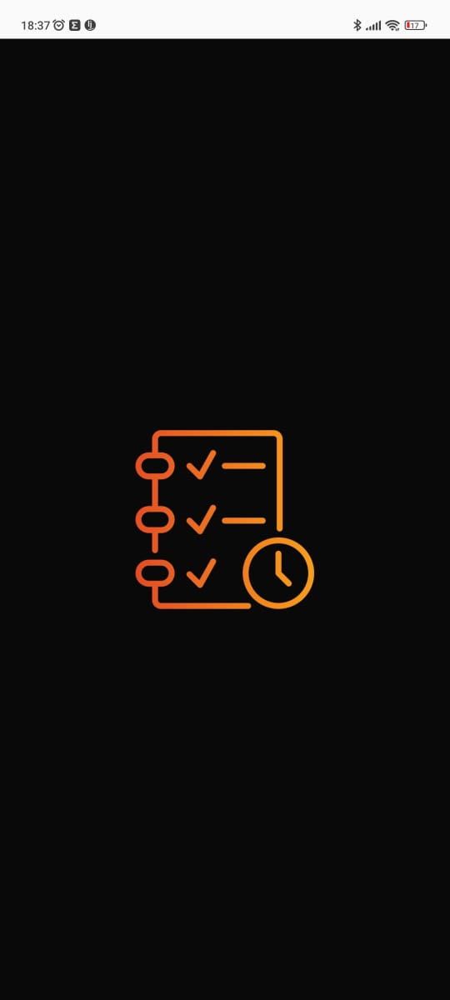
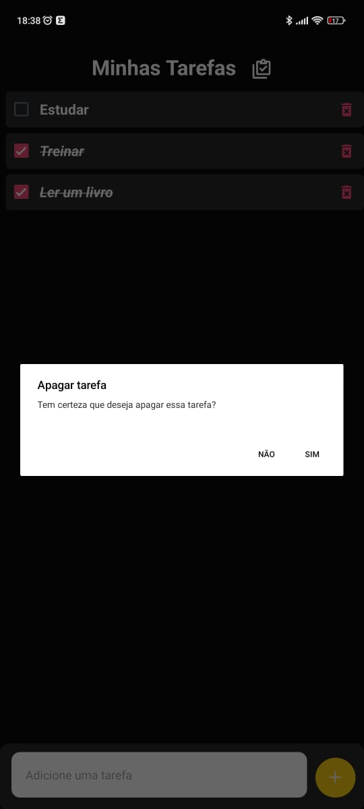

<h1 align="center"> To Do App - React Native </h1>
<p  align="center" width=>



</p>

## 💻 Sobre o projeto
O projeto é um aplicativo de lista de tarefas desenvolvido em React Native + Expo e tailwindcss (nativewind). Ele permite que o usuário adicione tarefas a uma lista, marque como concluídas e remova tarefas da lista. <br><br>
Utilizando o hook `useState` para gerenciar a lista de tarefas e as novas tarefas que são inseridas pelo usuário. Quando o usuário pressiona o botão adicionar, a nova tarefa é adicionada à lista de tarefas e a entrada é limpa. As tarefas são armazenadas no AsyncStorage para que persistam em todos os lançamentos do aplicativo. Quando uma tarefa é marcada como concluída ou removida, o estado é atualizado de acordo.<br><br>
Também utilizei `useEffect` para carregar as tarefas existentes do AsyncStorage quando o componente é renderizado pela primeira vez e para salvar a lista atualizada de tarefas no AsyncStorage quando a lista mudar.

## 👨‍💻 Rodando o projeto
Clone o projeto utilizando o comando:
```
git clone https://github.com/MoraisRafa/todo-app.git
```
Instale as dependências do projeto:
```
npm install
```
Rode o servidor do projeto com o comando:
```
npx expo start
```
Após esse comando aparecerá um QR code na tela.

Na loja de aplicativos do seu celular, procure pelo aplicativo Expo Go. É ele que irá rodar a aplicação. Basta abrir o aplicativo e scannear o QR code


## Autor

Feito por ***Rafael Morais***
<br>
👋🏽 Entre em contato!

[](https://www.linkedin.com/in/moraisrafaa/)
[](mailto:faael.elias@outlook.com)
